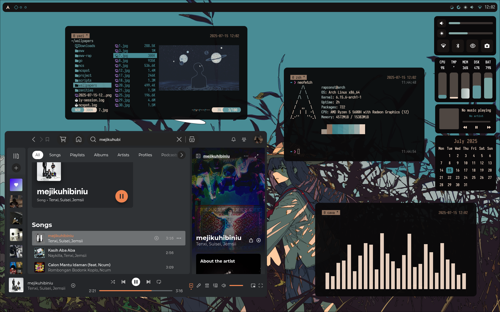
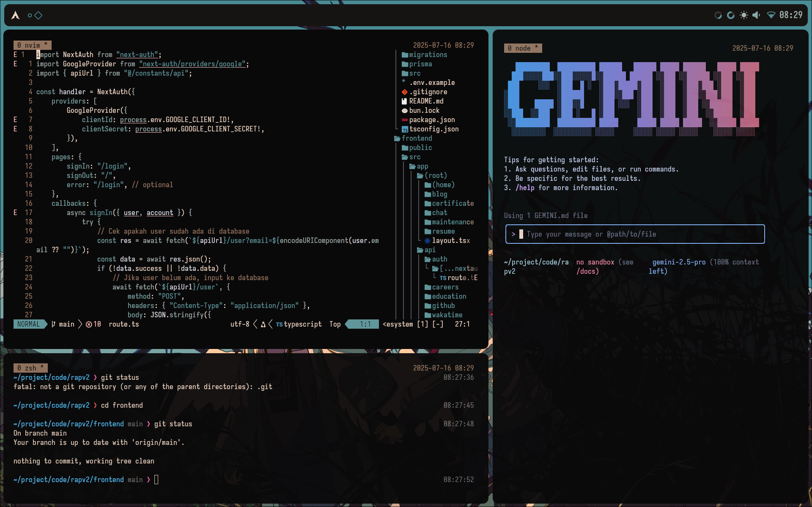

# dotfiles

My setup desktop/laptop (Arch Linux + Hyprland) configs

Hyprland based by [Zenities Hyprland](https://github.com/hayyaoe/zenities.git)

## Screenshot

## Keybinds

### ⚡ Launch Applications

| Action                 | Keybind                    | Description                          |
|------------------------|----------------------------|--------------------------------------|
| Terminal (tiled)       | `SUPER + RETURN`           | Launch terminal with `tmux`          |
| Terminal (floating)    | `SUPER + SHIFT + RETURN`   | Launch floating terminal             |
| File Manager (Yazi)    | `SUPER + M`                | Launch Yazi via custom script        |
| Yazi (floating)        | `SUPER + SHIFT + M`        | Launch Yazi in floating window       |
| Browser                | `SUPER + B`                | Launch your default browser          |
| App Launcher / Menu    | `SUPER + SPACE`            | Launch application menu (`$menu`)    |

---

### 🧰 System Scripts

| Action                  | Keybind                  | Description                            |
|-------------------------|--------------------------|----------------------------------------|
| Reload Wallpaper        | `SUPER + A`              | Reload Hyprpaper config                |
| Power Menu              | `SUPER + P`              | Launch power management script         |
| Select Wallpaper        | `SUPER + SHIFT + W`      | Run wallpaper selector script          |
| Launch Widgets          | `SUPER + H`              | Run Eww or custom widget script        |
| Reload Waybar           | `SUPER + R`              | Run Eww reload waybar script           |

---

### 🪟 Window Actions

| Action            | Keybind           | Description                           |
|-------------------|-------------------|---------------------------------------|
| Kill Window       | `SUPER + Q`       | Close the currently focused window    |
| Toggle Floating   | `SUPER + V`       | Toggle floating mode for active window|
| Toggle Split      | `SUPER + J`       | Toggle split orientation (vertical/horizontal) |
| Fullscreen        | `SUPER + F`       | Toggle fullscreen mode                |

---

### 📌 Window Focus
Use `ALT + [key]` to change focus between tiled windows:

| Direction | Keybind     |
|-----------|-------------|
| Left      | `ALT + h`   |
| Right     | `ALT + l`   |
| Up        | `ALT + k`   |
| Down      | `ALT + j`   |

---

### 🪟 Move Tiled Window
Use `ALT + SHIFT + [key]` to move a focused window in the specified direction:

| Direction | Keybind         |
|-----------|-----------------|
| Left      | `ALT + SHIFT + h` |
| Right     | `ALT + SHIFT + l` |
| Up        | `ALT + SHIFT + k` |
| Down      | `ALT + SHIFT + j` |

---

### 📏 Resize Tiled Window
Use `SUPER + ALT + [key]` to resize the focused window:

| Direction | Keybind              | Action       |
|-----------|----------------------|--------------|
| Shrink ←  | `SUPER + ALT + h`    | Resize left  |
| Expand →  | `SUPER + ALT + l`    | Resize right |
| Shrink ↑  | `SUPER + ALT + k`    | Resize up    |
| Expand ↓  | `SUPER + ALT + j`    | Resize down  |

---

### 🧲 Move Floating Window
Use `SUPER + CTRL + [key]` to move floating windows:

| Direction | Keybind              |
|-----------|----------------------|
| Left      | `SUPER + CTRL + h`   |
| Right     | `SUPER + CTRL + l`   |
| Up        | `SUPER + CTRL + k`   |
| Down      | `SUPER + CTRL + j`   |

## Details

- OS: **[Arch Linux](https://github.com/archlinux)**
- DE: **[Hyprland](https://github.com/hyprwm/Hyprland)**
- Terminal: **[Kitty](https://github.com/kovidgoyal/kitty)**
- Bar: **[eww](https://github.com/elkowar/eww)**
- App Launcher: **[Rofi](https://github.com/davatorium/rofi)**
- Editor: **[Neovim](https://github.com/neovim/neovim)**
- File Manager: **[yazi](https://github.com/sxyazi/yazi)**

This rice utilized pywal to create custom colorscemes depending on the wallpaper used.

## Credits
- **[hayyaoe](https://github.com/hayyaoe)**
- **[Rxyhn](https://github.com/rxyhn/tokyo)**
- **[saimoomedits](https://github.com/saimoomedits/eww-widgets/tree/main)**
- **[Vimjoyer](https://www.youtube.com/@vimjoyer)**
